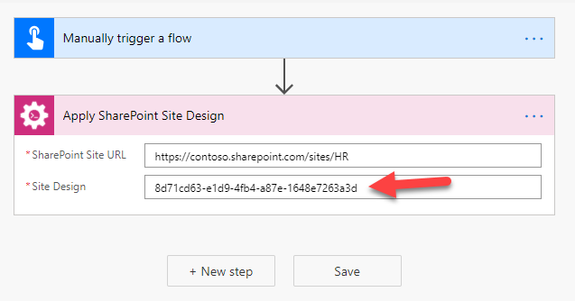

How to apply a site design to SharePoint site using Apply Site Design action
=====================================================================================

This article demonstrates how to create a Site design and add it to your SharePoint domain and apply it using `Apply Site Design action <https://plumsail.com/docs/actions/v1.x/flow/actions/sharepoint-processing.html#apply-sharepoint-site-design>`_.

Firstly, let's check how to create a site design. We'll check an example of a site design that adds a list to a site.

How to create a site design that adds a list to a site
--------------------------------------------------------

I use this website `sitedesigner.io <https://www.sitedesigner.io/#/>`_ to create a site design that adds a list to a SharePoint site.

There is a friendly user interface where you can add the elements. The system will generate a script automatically to add this design.

Let's say I want to create a site design that adds a list with employees. The list has several fields:

Full name, Job Title, Department, Office, Work Phone and Work Email

This is how the scheme looks

Then I can export the site design to a power shell script

This is the site design JSON:

.. code:: json

   {
    "$schema": "schema.json",
    "actions": [
        {
            "verb": "setRegionalSettings",
            "locale": 1033,
            "sortOrder": 25
        },
        {
            "verb": "addPrincipalToSPGroup",
            "principal": "ContosoAdmins",
            "group": "Visitors"
        },
        {
            "verb": "createSPList",
            "listName": "Employees",
            "templateType": 100,
            "subactions": [
                {
                    "displayName": "Full name",
                    "internalName": "fullName",
                    "isRequired": true,
                    "addToDefaultView": false,
                    "fieldType": "Text",
                    "enforceUnique": false,
                    "verb": "addSPField"
                },
                {
                    "displayName": "Job Title",
                    "internalName": "jobTitle",
                    "isRequired": true,
                    "addToDefaultView": false,
                    "fieldType": "Text",
                    "enforceUnique": false,
                    "verb": "addSPField"
                },
                {
                    "displayName": "Department",
                    "internalName": "department",
                    "isRequired": true,
                    "addToDefaultView": false,
                    "fieldType": "Text",
                    "enforceUnique": false,
                    "verb": "addSPField"
                },
                {
                    "displayName": "Office",
                    "internalName": "office",
                    "isRequired": true,
                    "addToDefaultView": false,
                    "fieldType": "Text",
                    "enforceUnique": false,
                    "verb": "addSPField"
                },
                {
                    "displayName": "Work Phone",
                    "internalName": "workPhone",
                    "isRequired": true,
                    "addToDefaultView": false,
                    "fieldType": "Text",
                    "enforceUnique": false,
                    "verb": "addSPField"
                },
                {
                    "displayName": "Work Email",
                    "internalName": "workEmail",
                    "isRequired": true,
                    "addToDefaultView": false,
                    "fieldType": "Text",
                    "enforceUnique": false,
                    "verb": "addSPField"
                },
                {
                    "verb": "setTitle",
                    "title": "employees"
                }
             ]
          }
      ],
      "bindata": {},
      "version": 1
    }

.. note::

   You can download the sample `JSON <../../../_static/files/flow/how-tos/apply-site-design-json-sample.json>`_ and `PowerShell script <../../../_static/files/flow/how-tos/employees_list_sitescript.ps1>`_ or just make you own JSON or PS script to add a site design.

How to add a site design to your SharePoint tenant
---------------------------------------------------

Now, when we have the PowerShell script we can add this site design to a SharePoint tenant.

Then I start PowerShell under administrator account and run the script. The report shows that the script is added to the site.

Also, I can see that the site design is available in the list of the designs

How to apply a site design to a SharePoint site using Apply Site Design action
-------------------------------------------------------------------------------------

Our site design creates a list of employees.  We can apply the site to any existing site.

This is a simple flow to do this:

You can use the action with Site Design ID too. To get the ID you can use a PowerShell command `Get-SPOSiteDesign <https://docs.microsoft.com/en-us/powershell/module/sharepoint-online/get-spositedesign>`_

Then use the ID in the action

After running the flow the site is updated and the new list appears in the site contents

Conclusion
----------

`Apply Site Design action <https://plumsail.com/docs/actions/v1.x/flow/actions/sharepoint-processing.html#apply-sharepoint-site-design>`_ is a useful tool to modify your sites: apply small changes or even complex projects.