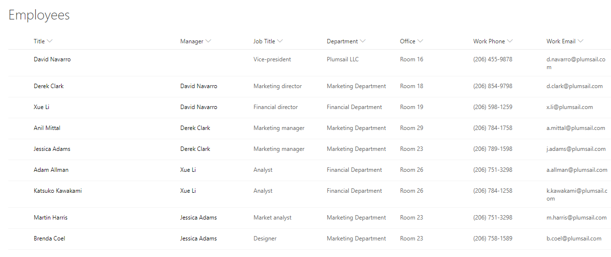
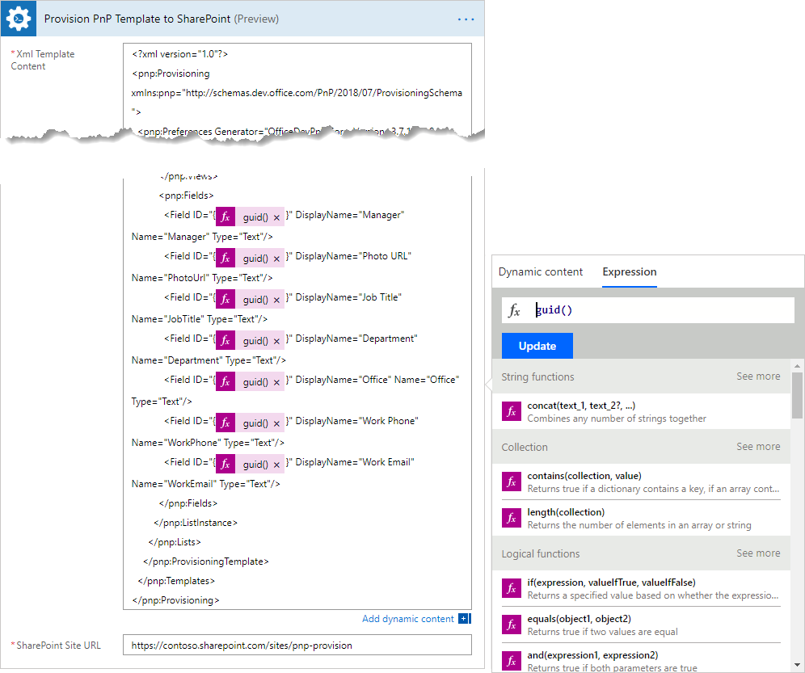

How to create SharePoint list or library using PnP provisioning template in Microsoft Flow, Azure Logic Apps or PowerApps
=========================================================================================================================

This article will show how to create a custom SharePoint list or library using PnP provisoning template. You can use this approach to create sites or lists of any complexity in SharePoint. For example, you may want to create an employees list with a set of predefined columns for your team. We will do it below. The same approach works for provision of SharePoint document library as well.

PnP template is an XML file that contains a description of SharePoint entities (lists, libraries, pages, etc.) that you want to create. You can create own XML template for your Modern SharePoint list or library. Then use the `Provision PnP template to SharePoint <../../actions/sharepoint-processing.html#provision-pnp-template-to-sharepoint>`_ action from `Plumsail Actions <https://plumsail.com/actions>`_ to apply PnP templates to your SharePoint sites using Microsoft Flow or Azure Logic Apps.

If you are new to Plumsail Actions, follow `this getting started instruction <../../getting-started/sign-up>`_.

First of all, we need to create a PnP provisioning template for our list. Let us say we have the employees list:

There are two ways to create a PnP template:

1. :ref:`write-template-manually` - It is useful for simple lists without custom views or content types.
2. :ref:`create-template-from-existing-list` - It is useful for complex lists with content types, views, site columns.

.. _write-template-manually:

Write a PnP template manually and provision a simple list
---------------------------------------------------------

This approach is useful for creation of simple lists or document libraries without custom content types, site columns, etc. Below you can see example of a template for simple employees list:

.. code:: 

  <?xml version="1.0"?>
  <pnp:Provisioning xmlns:pnp="http://schemas.dev.office.com/PnP/2018/07/ProvisioningSchema">
    <pnp:Preferences Generator="OfficeDevPnP.Core, Version=3.7.1903.0, Culture=neutral, PublicKeyToken=5e633289e95c321a" />
    <pnp:Templates ID="CONTAINER-TEMPLATE-C1181F206BE84C09AAAC4B3CB21FBE32">
      <pnp:ProvisioningTemplate ID="TEMPLATE-C1181F206BE84C09AAAC4B3CB21FBE32" Version="1" Scope="Web">
        <pnp:Lists>
          <pnp:ListInstance Title="Employees List3" TemplateType="100" Url="Lists/EmployeesList3" EnableFolderCreation="false">
            <pnp:ContentTypeBindings>
              <pnp:ContentTypeBinding ContentTypeID="0x01" Default="true" />
              <pnp:ContentTypeBinding ContentTypeID="0x0120" />
            </pnp:ContentTypeBindings>   
            <pnp:Views>
              <View Name="AllItems" DefaultView="TRUE" Type="HTML" DisplayName="All Items" Level="1" BaseViewID="1" ContentTypeID="0x">
                <Query>
                  <OrderBy>
                    <FieldRef Name="ID" />
                  </OrderBy>
                </Query>
                <ViewFields>
                  <FieldRef Name="LinkTitle" />
                  <FieldRef Name="Manager" />
                  <FieldRef Name="PhotoUrl" />
                  <FieldRef Name="JobTitle" />
                  <FieldRef Name="Department" />
                  <FieldRef Name="Office" />
                  <FieldRef Name="WorkPhone" />
                  <FieldRef Name="WorkEmail" />
                </ViewFields>
                <RowLimit Paged="TRUE">30</RowLimit>              
              </View>
            </pnp:Views>       
            <pnp:Fields>
              <Field ID="{4512a091-1007-4cd9-900b-411f01f2b119}" DisplayName="Manager" Name="Manager" Type="Text"/>
              <Field ID="{2980c003-7607-46de-8676-6c64cd2a3431}" DisplayName="Photo URL" Name="PhotoUrl" Type="Text"/>
              <Field ID="{50ef44ad-091f-4955-a957-b0fb9b42811b}" DisplayName="Job Title" Name="JobTitle" Type="Text"/>
              <Field ID="{346ada44-fd5f-4ed2-85af-d9be52a79f51}" DisplayName="Department" Name="Department" Type="Text"/>
              <Field ID="{f3340208-afe4-404e-bbe3-86edf38e4e52}" DisplayName="Office" Name="Office" Type="Text"/>
              <Field ID="{d9c0a3c9-b591-4646-92d2-95ebc693bed9}" DisplayName="Work Phone" Name="WorkPhone" Type="Text"/>
              <Field ID="{8c612e69-e32d-4d34-9e38-32fadedc9575}" DisplayName="Work Email" Name="WorkEmail" Type="Text"/>
            </pnp:Fields>                    
          </pnp:ListInstance>
        </pnp:Lists>
      </pnp:ProvisioningTemplate>
    </pnp:Templates>
  </pnp:Provisioning>

Let us review what you can change in the template.

<pnp:ListInstance> tag
~~~~~~~~~~~~~~~~~~~~~~

:code:`<pnp:ListInstance>` tag represents a list. You can change list title (:code:`Title`) and list URL (:code:`Url`). Also, if you want to create a document library, you need to change :code:`TemplateType` to :code:`101` instead of :code:`100`. 

You can find all awailable template types in `the official Microsoft documentation <https://docs.microsoft.com/en-us/previous-versions/office/sharepoint-server/ms413878(v%3Doffice.15)>`_.

<Field> tag
~~~~~~~~~~~~~~~

:code:`<pnp:Field>` tag represents a column in your list. You can add new fields by adding new tags like this:

.. code:: 

  <pnp:Fields>
    <Field ID="{4512a091-1007-4cd9-900b-411f01f2b119}" DisplayName="Manager" Name="Manager" Type="Text"/>
    ...
  </pnp:Fields>

- :code:`DisplayName` is a display name of the field.
- :code:`Name` is an internal name of the field.
- :code:`Type` represents a type of the field. You can find all awailable types in `this article <https://docs.microsoft.com/en-us/previous-versions/office/sharepoint-server/ms428806(v%3Doffice.15)>`_.
- :code:`ID` is unique ID of the field. You can put here unique GUID or fill it dynamcially in your Microsoft Flow. See the example below.

<FieldRef> tag under <ViewFields>
~~~~~~~~~~~~~~~~~~~~~~~~~~~~~~~~~~~~~

:code:`<FieldRef>` tag under :code:`<ViewFields>` represents a field in a list view. If you want to add your new field in the list view, create the :code:`<FieldRef>` tag for it:

.. code:: 

  <ViewFields>
    <FieldRef Name="Manager" />
    ...
  </ViewFields>

For more information about tags available in PnP templates review `PnP provisioning schema <https://github.com/SharePoint/PnP-Provisioning-Schema/blob/master/ProvisioningSchema-2018-07.md>`_.

Example of Microsoft Flow
~~~~~~~~~~~~~~~~~~~~~~~~~

Copy and paste your template into `Provision PnP template to SharePoint <../../actions/sharepoint-processing.html#provision-pnp-template-to-sharepoint>`_ action in your Flow:

You need to replace all values for Field IDs using Microsoft Flow expressions like on the screenshot above. It will ensure that your fields will always have unique IDs.

This approach is useful, when you want to create simple SharePoint lists or document libraries. If you have a comples list with many views you may consider another option with creating your template from an existing list using PowerShell. For more information read below.

.. _create-template-from-existing-list:

Get a PnP template from an existing list and provision a complex list
---------------------------------------------------------------------

PnP PowerShell allows you to execute various command for manipulating SharePoint, including grabbing of a template from a SharePoint site.

First of all, you need to install PnP PowerShell. Follow `the installation instruction <https://docs.microsoft.com/en-us/powershell/sharepoint/sharepoint-pnp/sharepoint-pnp-cmdlets?view=sharepoint-ps#installation>`_. Then connect to your SharePoint site. Execute the command below and specify your own URL for the site where your Modern page is stored:

.. code::

  Connect-PnPOnline -Url https://mycompany.sharepoint.com/sites/mysite

Unfortunately, there are no PnP PowerShell commands for getting a template from a signle list. You could execute this command:

.. code::

  Get-PnPProvisioningTemplate -Out template.xml -Handlers Lists

But the command below creates a template for all lists and libraries on your site. If it is your case, you can use the code above. Otherwise, you need a workaround:

..code::

  $listName = "Employees";
  $outputTemplateFileName = "template.xml";
  $template = Get-PnPProvisioningTemplate -OutputInstance -Handlers Lists
  $listTemplate = $template.Lists | Where-Object { $_.Title -eq $listName }
  $template.Lists.Clear()
  $template.Lists.Add($listTemplate)
  Save-PnPProvisioningTemplate -InputInstance $template -Out $outputTemplateFileName

This scripts gets a template for a single list. Let's take a closer look:

- In the first line we specify title of the list. You need to replace "Employees" by the name of your script.
- In the second line we specify location of the output template. You can change "template.xml" to other path.
- The rest of the code takes a template for all list of the sites. Then it removes all the lists except the one we need.

Once you executed the script, you will have the template for your specific list or document library.

.. note:: This script gets a template of a list without external references like content types, site columns, etc. If you need to include them into the template, you need to modify the PowerShell script or do it manually in the XML.

However, in a real situation we need to save not all existing lists but a specific one. 
Standard PnP commandlets do not allow you to grab a template for a single list. That is why you need a workaround. 
Let's say you have a pnp template and deploy the template once new employee is hired. However, the source site gets a new list and you need to provide the list to all employees.
Instead of taking a template from the whole site you can take a template, including only specific list.

|listimg|

The next PowerShell script helps us to reach the goal:

If you open the resulting xml template you'll see that there is a description of only one list.Then you may apply the resulting xml using the Microsoft Flow action  `Provision PnP template to SharePoint`_ .

|flow|

Conclusion
----------

I've shown how to create a PnP provisioning template with a specific list or library and how to use this resulting template with Plumsail Actions.
If you haven’t used it yet, `registering an account`_ would be the first step. It is quite easy to get started.

.. hint::
  You may also be interested in `this article <https://plumsail.com/docs/actions/v1.x/flow/how-tos/sharepoint/get-template-using-power-shell.html>`_ explaining how to get a PnP provisioning template using PowerShell and then apply it in Microsoft Flow.

.. _Plumsail SharePoint connector: https://plumsail.com/docs/actions/v1.x/flow/actions/sharepoint-processing.html
.. _article: ../../how-tos/sharepoint/get-template-using-power-shell.html
.. _options: https://docs.microsoft.com/en-us/powershell/module/sharepoint-pnp/get-pnpprovisioningtemplate?view=sharepoint-ps
.. _registering an account: ../../../getting-started/sign-up.html

.. |flow| image:: ../../../_static/img/flow/sharepoint/provision-pnp-template-to-sp.png
.. |listimg| image:: ../../../_static/img/flow/sharepoint/new-tasks-list.png