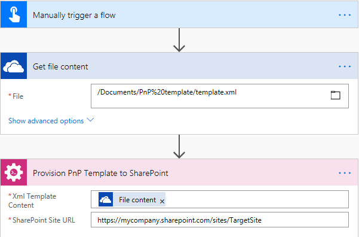
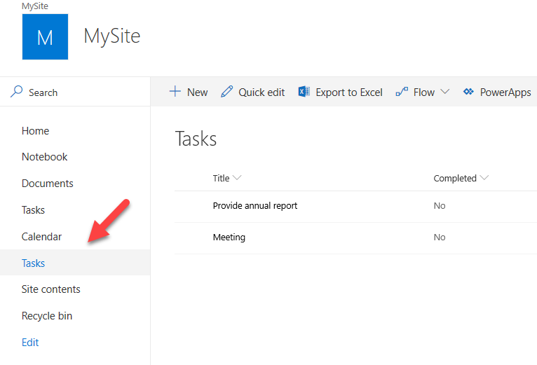

How to create SharePoint list or library using PnP provisioning template in Microsoft Flow, Azure Logic Apps or PowerApps
=========================================================================================================================

This article will show how to create a custom SharePoint list or library using PnP provisoning template. You can use this approach to create sites or lists of any complexity in SharePoint. For example, you may want to create a tasks list with a set of predefined columns for your team. We will do it below. The same approach works for provision of SharePoint document library as well.

PnP template is an XML file that contains a description of SharePoint entities (lists, libraries, pages, etc.) that you want to create. You can create own XML template for your Modern SharePoint list or library. Then use the `Provision PnP template to SharePoint <../../actions/sharepoint-processing.html#provision-pnp-template-to-sharepoint>`_ action from `Plumsail Actions <https://plumsail.com/actions>`_ to apply PnP templates to your SharePoint sites using Microsoft Flow or Azure Logic Apps.

If you are new to Plumsail Actions, follow `this getting started instruction <../../getting-started/sign-up>`_.

First of all, we need to create a PnP provisioning template. You can write your template from scratch. In this case you may need to review `PnP provision schema <https://github.com/SharePoint/PnP-Provisioning-Schema/blob/master/ProvisioningSchema-2018-07.md#clientsidepages>`_ first. 

It is much easier to create a PnP template from an existing list. That what we are going to do below. Let us say we have the tasks list:

image:: ../../../_static/img/flow/sharepoint/new-tasks-list.png
  :alt: Tasks list example

  
Get a PnP template from an list or library
------------------------------------------

PnP PowerShell allows you to execute various command for manipulating SharePoint, including grabbing of a template from a SharePoint site.

First of all, you need to install PnP PowerShell. Follow `the installation instruction <https://docs.microsoft.com/en-us/powershell/sharepoint/sharepoint-pnp/sharepoint-pnp-cmdlets?view=sharepoint-ps#installation>`_. Then connect to your SharePoint site. Execute the command below and specify your own URL for the site where your Modern page is stored:

.. code::

  Connect-PnPOnline -Url https://mycompany.sharepoint.com/sites/mysite

Then execute the command below:

.. code::

  Get-PnPProvisioningTemplate -Out template.pnp -Handlers Lists

Connect to the source SharePoint instance using PnP powershel commandlets library.
This `article`_ shows how to do this and also how to get a PnP provisioning template from the whole site.

We use :code:`Get-PnPProvisioningTemplate` Powershell function function to get a template. It has several `options`_, In our case we're interested in option :code:`-Handlers`.
For example, the command below creates a template for all lists and libraries on your site:

:code:`Get-PnPProvisioningTemplate -Out template.pnp -Handlers Lists`

However, in a real situation we need to save not all existing lists but a specific one. 
Standard PnP commandlets do not allow you to grab a template for a single list. That is why you need a workaround. 
Let's say you have a pnp template and deploy the template once new employee is hired. However, the source site gets a new list and you need to provide the list to all employees.
Instead of taking a template from the whole site you can take a template, including only specific list.

|listimg|

The next PowerShell script helps us to reach the goal:

..code::

  $listName = "Tasks";
  $outputTemplateFileName = "C:\Temp\template.xml";
  $template = Get-PnPProvisioningTemplate -OutputInstance -Handlers Lists
  $listTemplate = $template.Lists | Where-Object { $_.Title -eq $listName }
  $template.Lists.Clear()
  $template.Lists.Add($listTemplate)
  Save-PnPProvisioningTemplate -InputInstance $template -Out $outputTemplateFileName

Let's take a closer look at the script:

- We define 2 variables with list name and the path  where to save PnP template. Just replace “Tasks” by the name of your list. If you want to store result template in different location, replace “C:\Temp\template.xml” by different path.
- Then we take a template for all list a libraries from the site.
- Exclude all lists except the one that has name “Tasks”.
- Then remove all lists from the template and replace them by a our single list.
- Save the result template with a single list to a file.

If you open the resulting xml template you'll see that there is a description of only one list.Then you may apply the resulting xml using the Microsoft Flow action  `Provision PnP template to SharePoint`_ .

|flow|

Conclusion
----------

I've shown how to create a PnP provisioning template with a specific list or library and how to use this resulting template with Plumsail Actions.
If you haven’t used it yet, `registering an account`_ would be the first step. It is quite easy to get started.

.. hint::
  You may also be interested in `this article <https://plumsail.com/docs/actions/v1.x/flow/how-tos/sharepoint/get-template-using-power-shell.html>`_ explaining how to get a PnP provisioning template using PowerShell and then apply it in Microsoft Flow.

.. _Plumsail SharePoint connector: https://plumsail.com/docs/actions/v1.x/flow/actions/sharepoint-processing.html
.. _article: ../../how-tos/sharepoint/get-template-using-power-shell.html
.. _options: https://docs.microsoft.com/en-us/powershell/module/sharepoint-pnp/get-pnpprovisioningtemplate?view=sharepoint-ps
.. _registering an account: ../../../getting-started/sign-up.html

