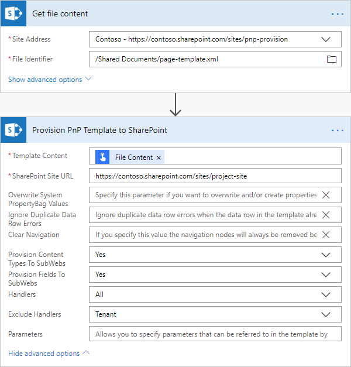

How to create a SharePoint Modern page using PnP provision template in Microsoft Flow, Azure Logic Apps, or PowerApps
==========================================================================================================

This article describes how to create a SharePoint Modern page using a PnP provisioning template. It may be quite useful when you want to automatically post some news to your Modern Communication site or migrate regular pages from one site to another.

`PnP template <https://docs.microsoft.com/en-us/sharepoint/dev/solution-guidance/pnp-provisioning-schema>`_ is an XML file that contains a description of SharePoint entities (lists, libraries, pages, etc.) that will be created. You can create own XML template for your Modern SharePoint page. Then use the `Provision PnP template to SharePoint <../../actions/sharepoint-processing.html#provision-pnp-template-to-sharepoint>`_ action from `Plumsail Actions <https://plumsail.com/actions/>`_ to apply PnP templates to your SharePoint sites using Microsoft Flow or Azure Logic Apps.

If you are new to Plumsail Actions, follow this `getting started instruction <../../../getting-started/sign-up.html>`_.

There are two ways to create a PnP template:

1. Write an XML manually from scratch. It is useful for simple text pages.
2. Use PowerShell to grab a template from existing SharePoint entities. It is useful for complex pages with many web parts.

At the end of this article you will be able to create complex pages with heading, text, picture, custom form web part like this:

Write a PnP template manually and provision news page
------------------------------------------------------

.. note::
  Our action supports the PnP template schema :code:`V202002` (or earlier).

This approach is useful for creation of simple text pages. Below you can see example template for a simple news page with the title "Breaking news!", content "We can create modern pages from Microsoft Flow!" and file name "news-page.aspx".

.. code-block:: XML

  <pnp:Provisioning xmlns:pnp="http://schemas.dev.office.com/PnP/2018/07/ProvisioningSchema">
    <pnp:Preferences Generator="OfficeDevPnP.Core, Version=3.7.1903.0, Culture=neutral, PublicKeyToken=5e633289e95c321a" />
    <pnp:Templates ID="CONTAINER-">
      <pnp:ProvisioningTemplate ID="page-template" Version="0">
        <pnp:ClientSidePages>
          <pnp:ClientSidePage PageName="news-page.aspx" PromoteAsNewsArticle="true" Overwrite="true" Title="Breaking news!">
            <pnp:Sections>
              <pnp:Section Order="1" Type="OneColumn">
                <pnp:Controls>
                  <pnp:CanvasControl WebPartType="Text" ControlId="c506a7aa-95e7-455b-af3e-3666b2529e9a" Order="1" Column="1">
                    <pnp:CanvasControlProperties>
                      <pnp:CanvasControlProperty Key="Text" Value="We can create modern pages from Microsoft Flow!" />
                    </pnp:CanvasControlProperties>
                  </pnp:CanvasControl>
                </pnp:Controls>
              </pnp:Section>
            </pnp:Sections>
            <pnp:Header Type="Default" />
          </pnp:ClientSidePage>
        </pnp:ClientSidePages>
      </pnp:ProvisioningTemplate>
    </pnp:Templates>
  </pnp:Provisioning>

You can replace those strings, paste this XML into the `Provision PnP template to SharePoint <../../actions/sharepoint-processing.html#provision-pnp-template-to-sharepoint>`_ action and use it in your Flow:

.. image:: ../../../_static/img/flow/how-tos/apply-simple-modern-page-pnp-template.png
   :alt: Apply simple Modern Page PnP template

You may notice that there is an XML tag :code:`CanvasControl`. This tag represents a web part on your page. 

It has the attribute :code:`WebPartType` - type of a web part. There are a few builtin types:

- Text	
- ContentEmbed	
- ContentRollup	
- Events	
- Hero	
- Image	
- List	
- NewsFeed	
- PageTitle	
- People	
- etc.

Thus, you can place different kinds of web parts on your page. However, most of them require tricky JSON configurations. You may research `PnP provision schema <https://github.com/SharePoint/PnP-Provisioning-Schema/blob/master/ProvisioningSchema-2018-07.md#clientsidepages>`_ to find more information about objects supported by available in PnP templates.

Often, if you want to create complex Modern pages, it is easier to create a page in the SharePoint user interface, then grab the PnP template from an existing page using PowerShell. Then you can modify it for your needs in any text editor. 

Read below for more information.

Get a PnP template from an existing page and provision a page
-------------------------------------------------------------

In this section, I will describe how to provision more complex Modern page. It will consist of custom heading, text, picture, custom form web part. You saw the screenshot of the page like this at the beginning of this article.

PnP PowerShell allows you to execute various commands for manipulating SharePoint, including grabbing of a template from a SharePoint site or from a Modern page.

First of all, you need to install PnP PowerShell. Follow `the installation instruction <https://docs.microsoft.com/en-us/powershell/sharepoint/sharepoint-pnp/sharepoint-pnp-cmdlets?view=sharepoint-ps#installation>`_. Then connect to your SharePoint site. Execute the command below and specify your own URL for the site where your Modern page is stored:

.. code-block:: powershell

  Connect-PnPOnline -Url "https://contoso.sharepoint.com/sites/mysite"

Then execute the command below:

.. code-block:: powershell

  Export-PnPClientSidePage -Identity "modern-page.aspx" -Out "page-template.xml"

Replace the "modern-page.aspx" to the file name of your modern page in the command. The template will be stored to "page-template.xml" file. You can specify another path for the XML file if you want.

Open this file. You will see this line at the top :code:`<pnp:ProvisioningTemplate Version="0" Scope="Undefined">`.

Change it to :code:`<pnp:ProvisioningTemplate ID="page-template" Version="0" Scope="Undefined">`. 

For some reasons, PnP PowerShell forgets to add "ID" attribute to the XML. That is why we need to add it manually. 

If you want to create your modern page as a news post change :code:`PromoteAsNewsArticle="false"` to :code:`PromoteAsNewsArticle="true"` as well.

.. note:: The XML PnP template contains the declaration of your page only. If there are any related entities, like pictures, you need to create them before applying the template.

That is all. Now you can save the template file somewhere in your SharePoint and use this file as a template in the `Provision PnP template to SharePoint <../../actions/sharepoint-processing.html#provision-pnp-template-to-sharepoint>`_ action:

If you haven’t used Plumsail Actions yet, `registering an account <../../../getting-started/sign-up.html>`_ would be the first step. It is quite easy to get started.

.. hint::
  You may also be interested in `this article <create-list-library-pnp.html>`_ explaining how to provision a list or a document library using PnP template.