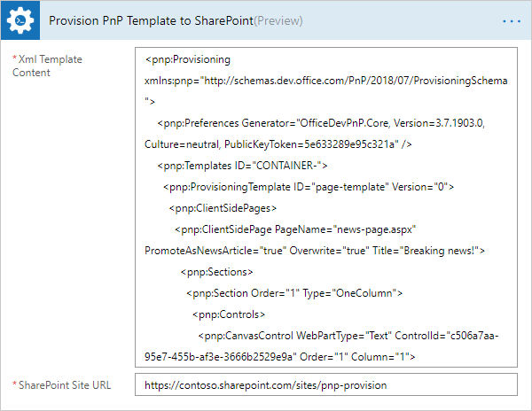

How to create a SharePoint Modern page using PnP provision template in Microsoft Flow, Azure Logic Apps, or PowerApps
==========================================================================================================

This article describes how to create a SharePoint Modern page using a PnP provisioning template. It may be quite useful, when you want to automatically post some news to your Modern Communication site or migrate regular pages from one site to another.

PnP templates are XML declarations that you can write to describe SharePoint entities that you want to create in your SharePoint sites. Then you can apply those PnP templates to your SharePoint. The PnP provision engine will create all entites that you described in the template to your site.

The `Provision PnP template to SharePoint <../../actions/sharepoint-processing.html#provision-pnp-template-to-sharepoint>`_ action from Plumsail Actions 

allows you to apply PnP templates to your SharePoint sites using Microsoft Flow or Azure Logic Apps.

There are two ways to craete a PnP template:

1. Write an XML manually from scratch
2. Use PowerShell to grab template from existing SharePoint entities

I this article we want to create SharePoint modern pages. Let us review both options for creating a template.

Write a PnP template manually and provision news page
------------------------------------------------------

Below you can see example template for a simple news page with title "Breaking news!", content "We can create modern pages from Microsoft Flow!" and file name "news-page.aspx".

.. code-block:: XML

  <pnp:Provisioning xmlns:pnp="http://schemas.dev.office.com/PnP/2018/07/ProvisioningSchema">
    <pnp:Preferences Generator="OfficeDevPnP.Core, Version=3.7.1903.0, Culture=neutral, PublicKeyToken=5e633289e95c321a" />
    <pnp:Templates ID="CONTAINER-">
      <pnp:ProvisioningTemplate ID="page-template" Version="0">
        <pnp:ClientSidePages>
          <pnp:ClientSidePage PageName="news-page.aspx" PromoteAsNewsArticle="true" Overwrite="true" Title="Breaking news!">
            <pnp:Sections>
              <pnp:Section Order="1" Type="OneColumn">
                <pnp:Controls>
                  <pnp:CanvasControl WebPartType="Text" ControlId="c506a7aa-95e7-455b-af3e-3666b2529e9a" Order="1" Column="1">
                    <pnp:CanvasControlProperties>
                      <pnp:CanvasControlProperty Key="Text" Value="We can create modern pages from Microsoft Flow!" />
                    </pnp:CanvasControlProperties>
                  </pnp:CanvasControl>
                </pnp:Controls>
              </pnp:Section>
            </pnp:Sections>
            <pnp:Header Type="Default" />
          </pnp:ClientSidePage>
        </pnp:ClientSidePages>
      </pnp:ProvisioningTemplate>
    </pnp:Templates>
  </pnp:Provisioning>

In general, you can replace those strings, paste this XML into the "Provision PnP tempate to SharePoint" action and use it:

You may notice that there is a property of :code:`CanvasControl` object called :code:`WebPartType`. There are a few builtin types:

- Text	
- ContentEmbed	
- ContentRollup	
- Events	
- Hero	
- Image	
- List	
- NewsFeed	
- PageTitle	
- People	
- etc.

Thus, you can place different kind of web parts on your page. However, most of them require tricky JSON configurations. You may research `PnP provision schema <https://github.com/SharePoint/PnP-Provisioning-Schema/blob/master/ProvisioningSchema-2018-07.md#clientsidepages>`_ to find more information about `CanvasControl` template object.

Often, if you want to create complext Modern pages, it is easier to create a page in SharePoint user interface, then grab PnP template from existing page using PowerShell. Read below for details.

Get a PnP template from an existing page and provision a page
-------------------------------------------------------------

PnP PowerShell allows you to execute various command for manipulating SharePoint, including grabbing of a template from a SharePoint site or from a Modern page.

First of all follow `the installation instruction <https://docs.microsoft.com/en-us/powershell/sharepoint/sharepoint-pnp/sharepoint-pnp-cmdlets?view=sharepoint-ps#installation>`_. Once you have PnP PowerShell, connec to your SharePoint site. Execute the command below and specify your own URL for the site where your Modern page is stored:

:code:`Connect-PnPOnline -Url https://mycompany.sharepoint.com/sites/mysite`

Then specify execute the command below:

:code:`Export-PnPClientSidePage -Identity "modern-page.aspx" -Out PageTemplate.xml`

Replace the "modern-page.aspx" to the file name of your modern page. The template will be stored to "PageTemplate.xml" file.

Open this file. You will see this line at the top :code:`<pnp:ProvisioningTemplate Version="0" Scope="Undefined">`.

Change it to :code:`<pnp:ProvisioningTemplate ID="page-template" Version="0" Scope="Undefined">`. 

For some reasons PnP PowerShell forgets to add ID attribute to the XML. That is why we need to add it manually. 

If you want to create your modern page as a news post change :code:`PromoteAsNewsArticle="false"` to :code:`PromoteAsNewsArticle="true"` as well.

Save the file. 

That is all. Now you can use this file as a template in the microsoft Flow Action:

.. image:: ../../../_static/img/flow/how-tos/apply-complex-modern-page-pnp-template.png
   :alt: Apply complex Modern Page PnP template