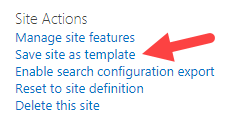
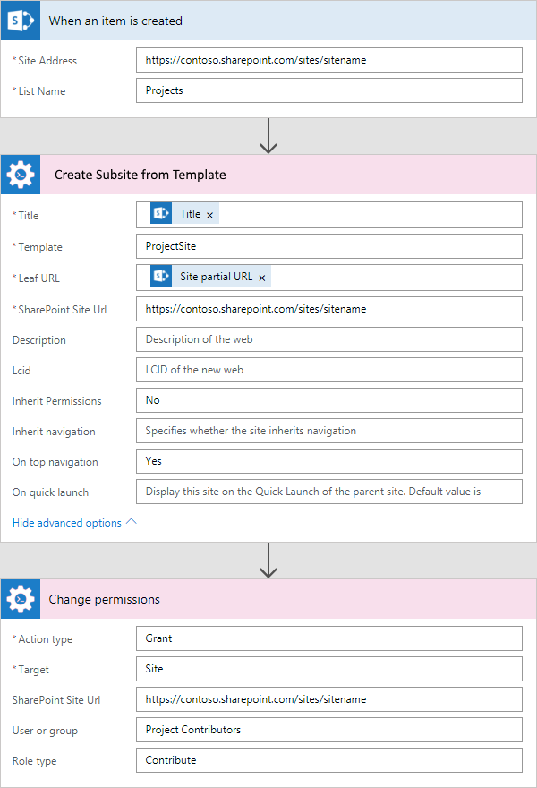

Create SharePoint subsite by custom template and grant permissions in Power Automate (Microsoft Flow) and Azure Logic Apps
==========================================================================================================================

This article will show how to use Power Automate (Microsoft Flow) to create a new subsite by the custom template and then grant permissions to this site for specific SharePoint group. As an example, I configured the Flow for SharePoint list to automatically create new sites.

In this case, I'm using *‘Create Subsite from Template’* and *‘Change Permissions’* actions from Plumsail SP connector, which is a part of `Plumsail Actions <https://plumsail.com/actions>`_.

This example will show a simple case of project management system when an administrator can create a new list item for a project in SharePoint list, specify project participants and URL for a new project workspace. Once it is done, the Flow has to create the project workspace (SharePoint site). It will automatically break permissions inheritance for the new site and include the site to the top navigation. Then you can grant permissions to sensitive information in the project for any SharePoint group. To simplify this use case I have one SharePoint group and contributors role only.

This article is divided into stages:

- :ref:`createSharePointList`
- :ref:`saveSiteAsTemplate`
- :ref:`configureMicrosoftFlow`

.. _createSharePointList:

Create a SharePoint list
------------------------

Here we need to create the new SharePoint list *‘Projects’*  with the following structure:

* Title – Text field. The title of a project.
* Site partial URL – The text field. The partial URL for a new project site (for example, *‘project1′* can be used to create subsite with URL like this: :code:`http://yourdomain/projects/project1`)

This is how the new form looks like:
 
.. image:: ../../../_static/img/flow/how-tos/sharepoint/create-site-list-new-item.png
   :alt: Create a site

As I mentioned above I simplified this example to keep it clear. You can add more fields to this list to work with your projects. For example, you can add the field *‘Project Template’*  and use it for specifying the name of the template to create a new SharePoint site.

.. _saveSiteAsTemplate:

Save site as template
---------------------

For demo purposes, we customized SharePoint team site to use it as a project workspace. I added some web parts to the main page and changed the style of the site. You can see my project site below:
 
.. image:: ../../../_static/img/flow/how-tos/sharepoint/create-site-template.png
   :alt: Site template   

Then it was saved as a template. To save a site as a template navigate to *‘Site Settings’* and click at *‘Save site as template’*:

If you don't see this option in your site settings, open URL for saving site as template directly. The URL looks like this:

.. code::

  http://yourdomain.sharepoint.com/_layouts/savetmpl.aspx

You need to append :code:`/_layouts/savetmpl.aspx` to the URL of the site that you want to save as a template.

Our template is called *‘ProjectSite’*. I will use this template in the Flow, you will see it below in the description of the Flow.

.. note::

  There are a few standard SharePoint templates that you can use without creating your own:                

  - Team site
  - Team site (classic experience)
  - Blog
  - Project Site
  - Community Site
  - Document Center
  - Records Center
  - Business Intelligence Center
  - Enterprise Search Center
  - Basic Search Center
  - Visio Process Repository
  - SAP Workflow Site        

.. _configureMicrosoftFlow:

Configure Power Automate (Microsoft Flow)
-----------------------------------------
Here we created the Flow and configured it to start on list item creation for *‘Projects’* list. Thus, new SharePoint sites will be created automatically after creation of a list item.

You can find more information about the specific parameters of the Flow actions in `the documentation <../../actions/sharepoint-processing.html>`_ .

The complete Flow is below:

As you can see I used *‘When an item is created’* trigger from *‘SharePoint’* connector and two actions: *‘Create Site from Template’* and *‘Change Permissions’*

When an item is created
~~~~~~~~~~~~~~~~~~~~~~~

Here we specified values for *‘Site Address’* and *‘List Name’* fields to bind the Flow to the *‘Project‘* list.

Create Subsite from Template
~~~~~~~~~~~~~~~~~~~~~~~~~~~~

`Create Subsite from Template <../../actions/sharepoint-processing.html#create-sharepoint-subsite-from-template>`_ action. I used *‘Title’* field of current list item as the title for SharePoint site.

I used *‘Site partial URL’* field of current list item as the partial URL for the new site (*‘Leaf URL’* field). As I mentioned at the beginning of this article *‘Site partial URL’*  field is the partial URL for the new site. For example, if the current site has URL :code:`http://yourdomain/projects`  and you specified *‘Site partial URL’*  as *‘project1′* , then the new site will have such URL: code:`http://yourdomain/projects/project1`.

Specified the URL of the site as the value for *‘SharePoint Site URL‘* field.

I used the name of created earlier site template *‘ProjectSite’* as the site template name.

Additionally in the setting of the Flow action was switched *‘Inherit Permissions’* property to *‘No’* . It means that a new site will not inherit permissions from a parent site.

Also, pay attention to the property *‘On top navigation‘*, it has *‘Yes’*  value by default. It allows adding new sites to the top navigation of the parent site automatically. Thus, you will be able to start working with the project site without adding it to navigation manually.

Change Permissions
~~~~~~~~~~~~~~~~~~

In the `Change Permissions on SharePoint site, list or list item <../../actions/sharepoint-processing.html#change-permissions-on-sharepoint-site-list-or-list-item>`_ action, I firstly choose *‘Grant’* value for *‘Action type’* field and *‘Site’* value for *‘Target’* field.

Then others fields of the form generated automatically based on my parameters.

And after that, I specified *‘Role type‘* field as *‘Contribute’* and the name of the existing Sharepoint group *‘Project Contributors’* as the value of *‘User or group’* field. Also, I specified the URL of the site as the value for *‘SharePoint Site URL‘* field.

That is all, the Flow is configured.

.. hint::

  You may also be interested in `this article <https://plumsail.com/docs/actions/v1.x/flow/how-tos/sharepoint/create-modern-sharepoint-site.html>`_ explaining how to create a modern team or communication SharePoint site in Power Automate (Microsoft Flow) and Azure Logic Apps.
