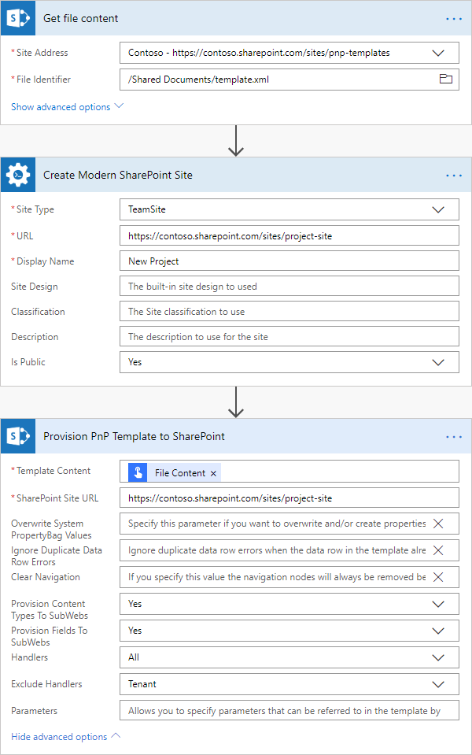

How to create Modern SharePoint Team or Communication site using PnP provisioning template in Microsoft Flow, Azure Logic Apps or PowerApps
===========================================================================================================================================

This article will show how to automatically create a Modern SharePoint Team site and apply a PnP template to it. You can use this approach to automate the creation of new SharePoint sites from custom templates. For example, you can create team sites for your projects with a predefined set of lists, libraries, etc. The same approach can work for Modern SharePoint Communication site as well.

`PnP template <https://docs.microsoft.com/en-us/sharepoint/dev/solution-guidance/pnp-provisioning-schema>`_ is an XML file that contains a description of SharePoint entities (lists, libraries, pages, etc.) that will be created. You can create own XML template for your SharePoint site. Then use the `Provision PnP template to SharePoint <../../actions/sharepoint-processing.html#provision-pnp-template-to-sharepoint>`_ action from `Plumsail Actions <https://plumsail.com/actions>`_ to apply PnP templates to your SharePoint sites using Microsoft Flow or Azure Logic Apps.

If you are new to Plumsail Actions, follow `this getting started instruction <../../../getting-started/sign-up.html>`_.

First of all, we need to create a PnP provisioning template for our site. Let us say we have an existing projects site:

You can write a PnP template from scratch or grab it from an existing site using PowerShell.

If you are interested in the first way, review other our documentation articles:

- `Create lists or libraries from PnP template <create-list-library-pnp.html>`_
- `Create Modern pages from PnP template <create-modern-page-pnp-template.html>`_

In this article, we will use PnP PowerShell to get the template from an existing site.

PnP PowerShell allows you to execute various commands for manipulating SharePoint, including grabbing of a template from a SharePoint site.

First of all, you need to install PnP PowerShell. Follow `the installation instruction <https://docs.microsoft.com/en-us/powershell/sharepoint/sharepoint-pnp/sharepoint-pnp-cmdlets?view=sharepoint-ps#installation>`_. Then connect to your SharePoint site. Execute the command below and specify your own URL for the site that you want to use for the template:

.. code-block:: powershell

  Connect-PnPOnline -Url "https://contoso.sharepoint.com/sites/mysite"

Then execute the command below:

.. code-block:: powershell

  Get-PnPProvisioningTemplate -Out "template.xml"

This command gets a template of the whole site and saves it to "template.xml" file. You can change this location if you want. 

The :code:`Get-PnPProvisioningTemplate` command has a lot of parameters. For example, you can specify content that you want to grab using :code:`-Handlers` parameter. Review `the official documentation <https://docs.microsoft.com/en-us/powershell/module/sharepoint-pnp/get-pnpprovisioningtemplate?view=sharepoint-ps>`_ for more information.

Once you executed the script, you will have the template for your site. You can modify it in any text editor if you want.

Now you can save the template file somewhere in your SharePoint and use this file as a template in the `Provision PnP template to SharePoint <../../actions/sharepoint-processing.html#provision-pnp-template-to-sharepoint>`_ action.

This action doesn't create a new site. It has to be applied to an existing site. That is why in the Flow below we firstly create a modern site using another action, then apply our template to the site:

That is all! Now you can create Modern SharePoint sites and apply custom templates to them.

.. hint::
  You may also be interested in `this article <create-list-library-pnp.html>`_ explaining how to create SharePoint lists or document libraries using PnP template.