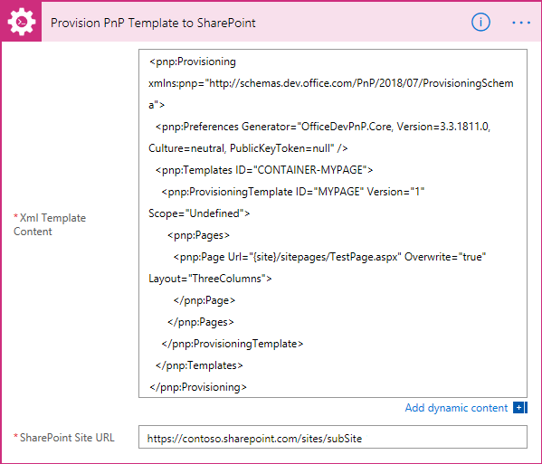

How to get a PnP provisioning template using PowerShell and then apply it in Microsoft Flow
============================================================================================================================

This article will show how to create a PnP template via PowerShell. As a result we'll have an XML file 
which can be used with Plumsail SharePoint connector `Provision PnP template to SharePoint`_ .

Create a SharePoint list with custom columns
~~~~~~~~~~~~~~~~~~~~~~~~~~~~~~~~~~~~~~~~~~~~
First of all you need to install SharePoint PnP library of PowerShell commands.
Microsoft provides 3 ways to install the cmdlets and you can find them in the `official MS article`_ .

The fastest way to do this is to run the command in MS PowerShell console

:code:`Install-Module SharePointPnPPowerShellOnline`

After installing the cmdlets you need to connect to your SharePoint site:

:code:`Connect-PnPOnline -Url https://mycompany.sharepoint.com/sites/mysite`

or in case of multi-factor authentication use

:code:`Connect-PnPOnline -Url https://yoursite.sharepoint.com -UseWebLogin`

Once connected we use next command to take a template from the whole site

:code:`Get-PnPProvisioningTemplate -Out path`

For example, :code:`Get-PnPProvisioningTemplate -Out C:\Temp\Template.xml`

This command creates an xml file which has the whole structure of the Sharepoint site and we

can use the file in MS flow and select it in `Provision PnP template to SharePoint`_ .

|flow|

Conclusion
----------

Using PnP provisioning technology and Plumsail Actions connector allows you to flexibly take and deploy a Sharepoint site template.
I also recommend you take alook at another article `How to create SharePoint list from PnP provisioning template in Microsoft Flow`_.
If you haven’t used it yet, `registering an account`_ would be the first step. It is quite easy to get started.

|flow1|

.. _Plumsail SharePoint connector: https://plumsail.com/actions/sharepoint/
.. _official MS article: https://docs.microsoft.com/en-us/powershell/sharepoint/sharepoint-pnp/sharepoint-pnp-cmdlets?view=sharepoint-ps#installation
.. _official MIcrosoft documentation: https://docs.microsoft.com/en-us/powershell/module/sharepoint-pnp/add-pnpapp?view=sharepoint-ps
.. _other PnP functions: https://docs.microsoft.com/en-us/powershell/module/sharepoint-pnp/add-pnpdatarowstoprovisioningtemplate?view=sharepoint-ps
.. _Provision PnP template to SharePoint: ../../actions/sharepoint-processing.html#provision-pnp-template-to-sharepoint
.. _manually: ../../actions/sharepoint-processing.rst#provision-pnp-template-to-sharepoint
.. _registering an account: ../../../getting-started/sign-up.html
.. _How to create SharePoint list from PnP provisioning template in Microsoft Flow: ../../../getting-started/sign-up.html

.. |flow| image:: ../../../_static/img/flow/sharepoint/provision-pnp-template-to-sp.png
