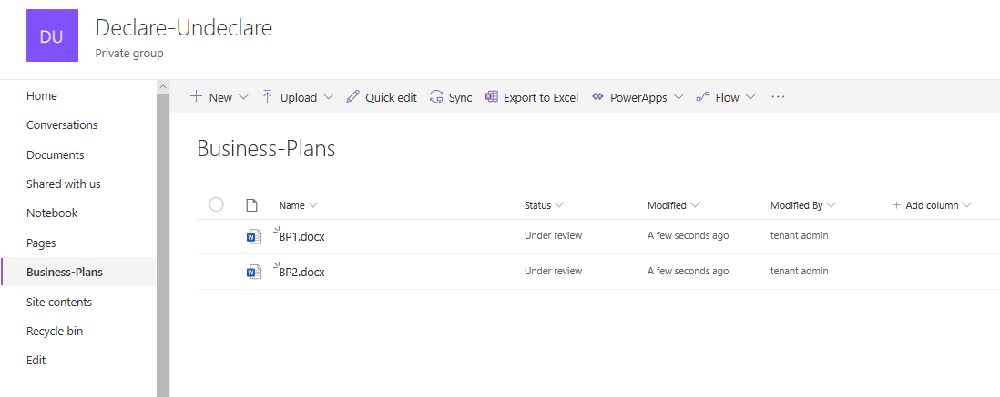
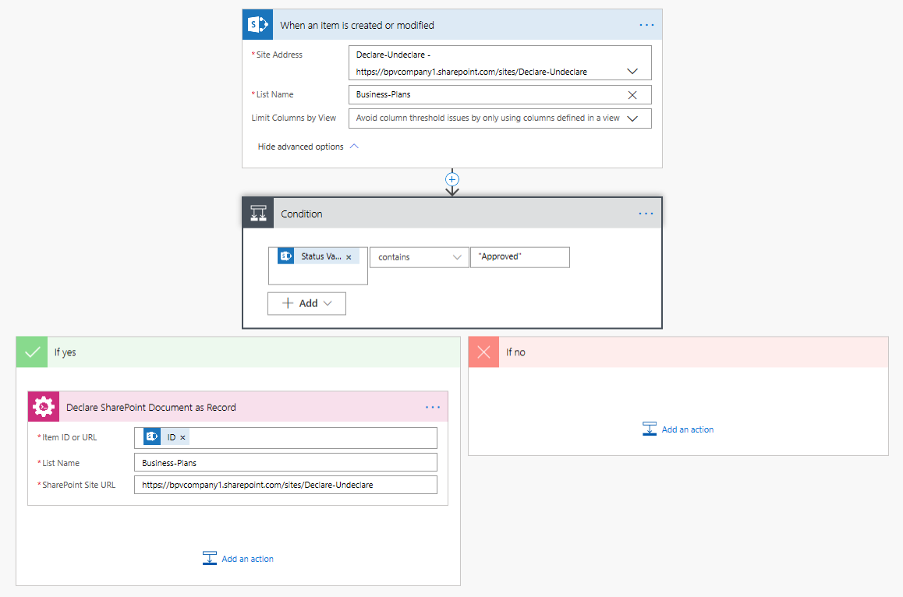
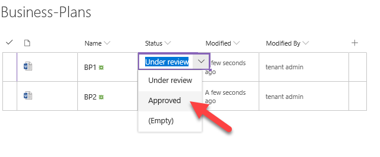

How to declare SharePoint documents as a record
====================================================================================

This article will show how to declare SharePoint document as a record with help of  `Declare action <https://plumsail.com/docs/actions/v1.x/flow/actions/sharepoint-processing.html#declare-sharepoint-document-as-record>`_
from `Plumsail Actions package <https:https://plumsail.com/actions/>`_.

Let's says we have a document library with business plans. When a user upload the plan the status is set to "Under review".
I want to declare the document as a record after changing the status to "Approved".

I made the flow and it's started automatically when an item's status in the Business Plans library changed to "Approved"
I added 'if' condition to declare the item only if the status is changed to approved. It won't declare the item if some other changes are made or if new item is created.

So, let's change the status to "Approved' for the first document

Conclusion
----------

That's all! It's possible to manage your SharePoint site navigation very effectively using Plumsail Add/Remove navigation node action.