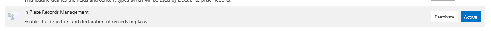
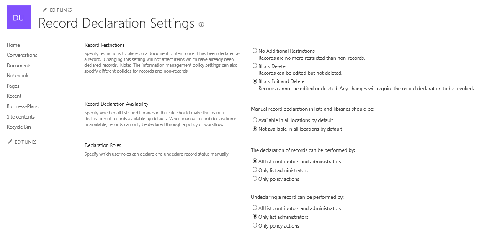
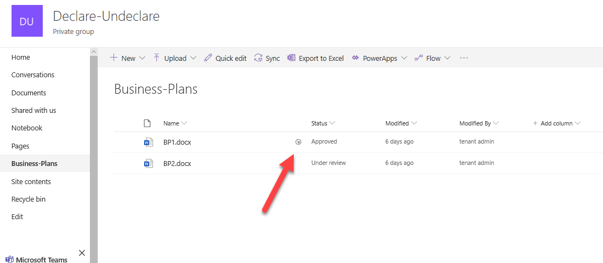
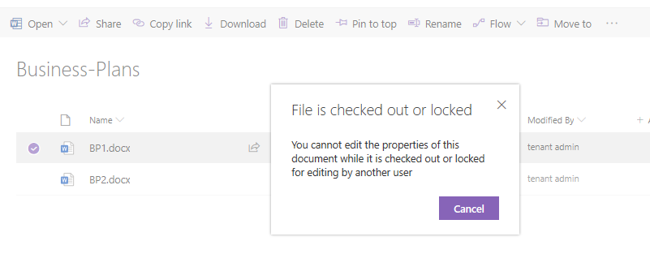

How to declare SharePoint documents as a record
====================================================================================

This article will show how to declare SharePoint document as a record with help of  `Declare action <https://plumsail.com/docs/actions/v1.x/flow/actions/sharepoint-processing.html#declare-sharepoint-document-as-record>`_
from `Plumsail Actions package <https:https://plumsail.com/actions/>`_.

Site settings
====================================================================================

To be able to declare SharePoint document as a record you need to enable the feature on the site level.

Go to Site settings - Site collection features and enable "In place records management" feature

Then if you go to the site settings again you'll se option "Record Declaration Settings",

These are the default settings. You can change it if it's needed

Example
====================================================================================

Let's says we have a document library with business plans. When a user upload the plan the status is set to "Under review".
I want to declare the document as a record after changing the status to "Approved".

.. image:: ../../../_static/img/flow/how-tos/sharepoint/business-plans-lib.png

I made the flow and it's started automatically when an item's status in the Business Plans library changed to "Approved"
I added 'if' condition to declare the item only if the status is changed to approved. It won't declare the item if some other changes are made or if new item is created.

.. image:: ../../../_static/img/flow/how-tos/sharepoint/declare-test-flow.png

So, let's change the status of the first document to "Approved'.

.. image:: ../../../_static/img/flow/how-tos/sharepoint/business-plans-doc-approved.png

And after the flow we can see that the document now has this symbol

If I try to delete it I see this notification

You can also Undeclare document using `Undeclare action <https://plumsail.com/docs/actions/v1.x/flow/actions/sharepoint-processing.html#undeclare-sharepoint-document-as-record>`_

Conclusion
----------

Now you should have an idea how to use `Declare action <https://plumsail.com/docs/actions/v1.x/flow/actions/sharepoint-processing.html#declare-sharepoint-document-as-record>`_
from `Plumsail Actions package <https:https://plumsail.com/actions/>`_.
If you haven’t used it yet, `registering an account`_ would be the first step. It is quite easy to get started.

.. _registering an account: ../../../getting-started/sign-up.html