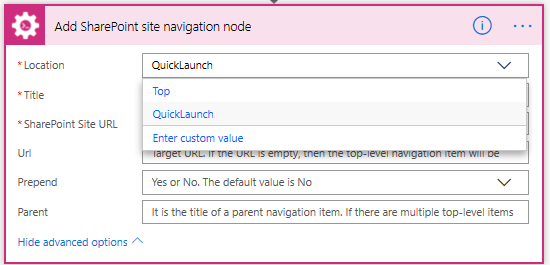
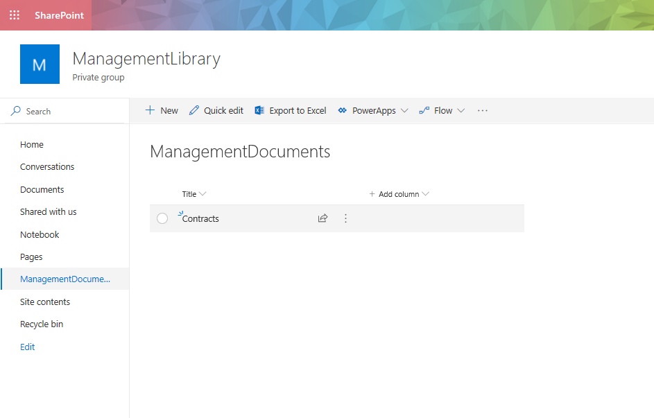
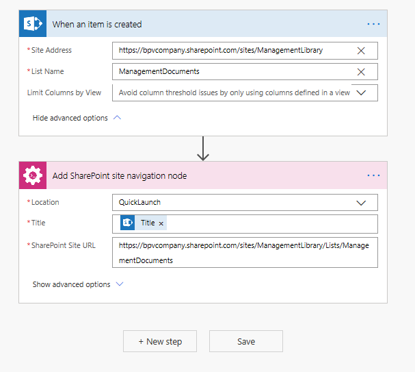
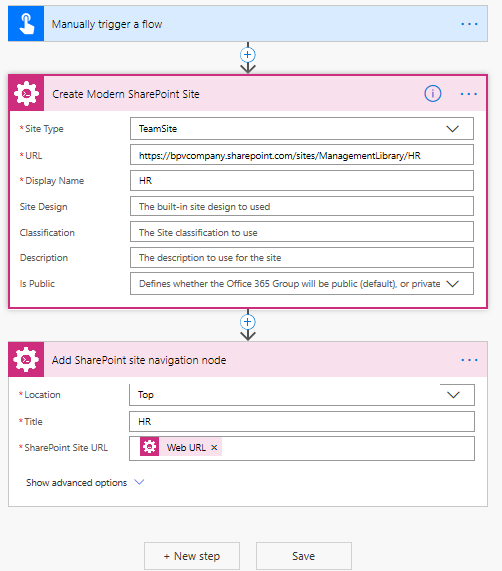

How to manage quick launch and top navigation items for a SharePoint site using Microsoft Flow or Azure Logic Apps
====================================================================================

This article will show how to manage quick launch and top navigation items for a SharePoint site using 2 Plumsail actions:

- Add SharePoint site navigation node
- Remove SharePoint site navigation node

You can add/remove a navigation node to/from 2 places: Top navigation bar or Quick launch 

Let's say you need to add a Quick launch navigation node each time when an item is created in a specific list.

We can use this simple flow which is triggered when an item is created.

Also we can add navigation nodes to the top menu. For example, there could be this flow

When you create a subsite the flow adds navigation node to the top menu of the parent site.

The same way you can program Microsoft flows which remove navigation nodes when an item or subsite is removed.

Conclusion
----------

That's all! You can manage your SharePoint site navigation very effectively using Plumsail Add/Remove navigation node action.