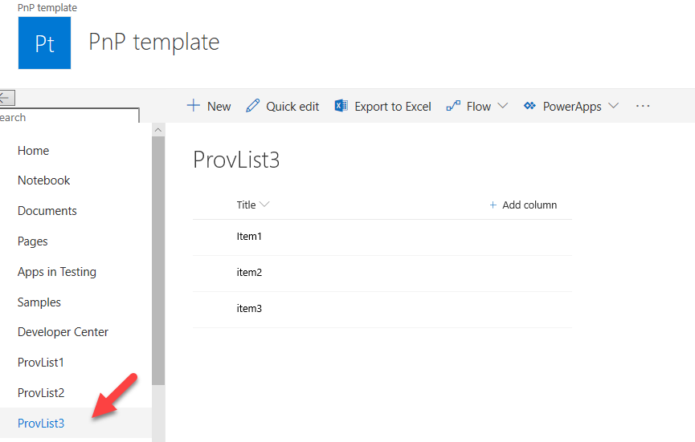

How to create SharePoint list or library from PnP provisioning template in Microsoft Flow
============================================================================================================================

This article will show how to create a PnP provisoning template for a list and then apply the template to a site by Microsoft Flow. The same approach works for a library.
We will use `Provision PnP template to SharePoint  <../../actions/sharepoint-processing.html#provision-pnp-template-to-sharepoint>`_ action from `Plumsail SP connector <https://plumsail.com/actions/sharepoint/>`_, which is a part of `Plumsail Actions <https://plumsail.com/actions>`_.

First of all, we need to create a PnP provisioning template. Connect to the source SharePoint instance using PnP powershel commandlets library.
This `article`_ shows how to do this and also how to get a PnP provisioning template from the whole site.

We use :code:`Get-PnPProvisioningTemplate` Powershell function function to get a template. It has several `options`_, In our case we're interested in option :code:`-Handlers`.
For example, the command below creates a template for all lists and libraries on your site:

:code:`Get-PnPProvisioningTemplate -Out template.pnp -Handlers Lists`

However, in a real situation we need to save not all existing lists but a specific one. 
Standard PnP commandlets do not allow you to grab a template for a single list. That is why you need a workaround. 
Let's say we created new list ProvList3 on the source site, the list has some items. Now we need to transfer only this list to the target site.

|listimg|

The next PowerShell script helps us to reach the goal:

..code::

  $listName = "ProvList3";
  $outputTemplateFileName = "C:\Temp\template.xml";
  $template = Get-PnPProvisioningTemplate -OutputInstance -Handlers Lists
  $listTemplate = $template.Lists | Where-Object { $_.Title -eq $listName }
  $template.Lists.Clear()
  $template.Lists.Add($listTemplate)
  Save-PnPProvisioningTemplate -InputInstance $template -Out $outputTemplateFileName

Let's take a closer look at the script:

- We define 2 variables with list name and the path  where to save PnP template. Just replace “MyList” by the name of your list. If you want to store result template in different location, replace “C:\Temp\template.xml” by different path.
- Then we take a template for all list a libraries from the site.
- Exclude all lists except the one that has name “MyList”.
- Then remove all lists from the template and replace them by a our single list.
- Save the result template with a single list to a file.

If you open the resulting xml template you'll see that there is a description of only one list.Then you may apply the resulting xml using the Microsoft Flow action  `Provision PnP template to SharePoint`_ .

|flow|

Conclusion
----------

I've shown how to create a PnP provisioning template with a specific list or library and how to use this resulting template with Plumsail Actions.
If you haven’t used it yet, `registering an account`_ would be the first step. It is quite easy to get started.

.. hint::
  You may also be interested in `this article <https://plumsail.com/docs/actions/v1.x/flow/how-tos/sharepoint/get-template-using-power-shell.html>`_ explaining how to get a PnP provisioning template using PowerShell and then apply it in Microsoft Flow.

.. _Plumsail SharePoint connector: https://plumsail.com/docs/actions/v1.x/flow/actions/sharepoint-processing.html
.. _article: ../../how-tos/sharepoint/get-template-using-power-shell.html
.. _options: https://docs.microsoft.com/en-us/powershell/module/sharepoint-pnp/get-pnpprovisioningtemplate?view=sharepoint-ps
.. _registering an account: ../../../getting-started/sign-up.html

.. |flow| image:: ../../../_static/img/flow/sharepoint/provision-pnp-template-to-sp.png
