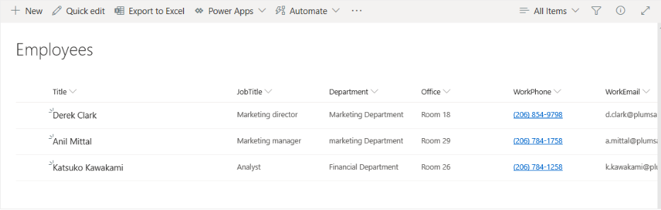

How to read a CSV file and add an item to SharePoint list in Power Automate and Azure Logic Apps
================================================================================================

In this article, we'll demonstrate how to read CSV files in Power Automate (Microsoft Flow) using `Parse CSV action <https://plumsail.com/docs/actions/v1.x/flow/actions/sharepoint-processing.html#parse-csv>`_ from Plumsail Documents connector.

Let's say we have a SharePoint list 'Employees' and we need to add information there from a CSV file.

The CSV file contains the same headers as the Employees list columns: Title, JobTitle, Department, Office, WorkPhone and WorkEmail

This is how our complete flow will look like:

I set the option 'Skip First Line' to 'Yes" since my CSV file has headers on the first line.

Our source CSV file has to be stored somewhere. Power Automate (Microsoft Flow) has a lot of connectors for different systems.

Here are just a few of them:

- SharePoint
- Salesforce
- Box
- OneDrive
- Google Drive
- Dropbox
- SFTP
- File System

You can store your files anywhere. In this example, we will store our source CSV file in OneDrive folder, but you can get data from any other sources.

I add new item using Create Item action from SharePoint connector and Apply to each action since we have 2 items to add.

After running the flow we have two new employees in the Employees list

You can download the sample csv `here <../../../_static/files/document-generation/demos/employees.csv>`_ .

Update a SharePoint list
------------------------
The same approach could be used to update a SharePoint list. However, in that case, you need to check if the item already exists.
To filter the existing items you can use **Get Items** action from **SharePoint connector**.

Conclusion
----------

That is it. These few simple steps can help you to update any SharePoint list using CSV file as the data source.

.. hint::
  You may also be interested in `this article <https://plumsail.com/docs/actions/v1.x/flow/how-tos/sharepoint/actions-read-a-CSV-file-and-bulk-generate-documents.html>`_ explaining how to read a CSV file in Power Automate (Microsoft Flow) and bulk generate documents.

