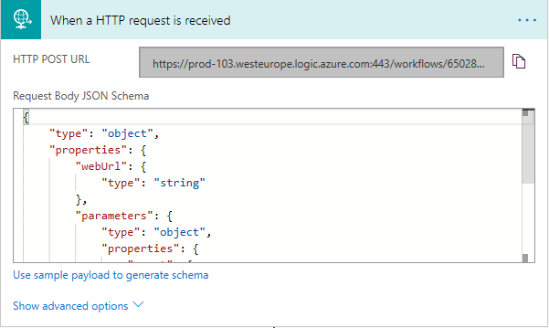
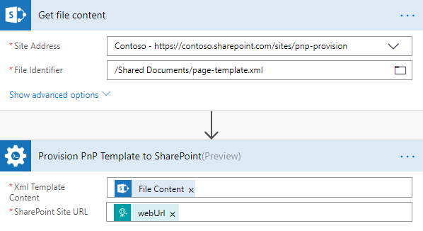
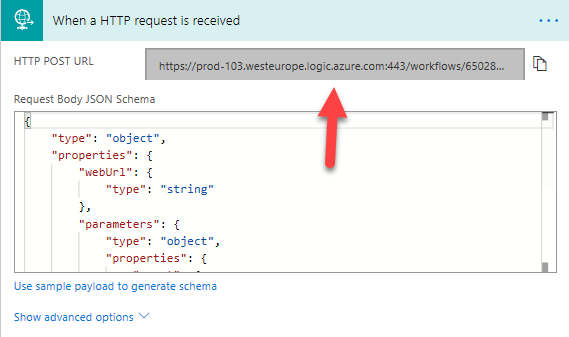
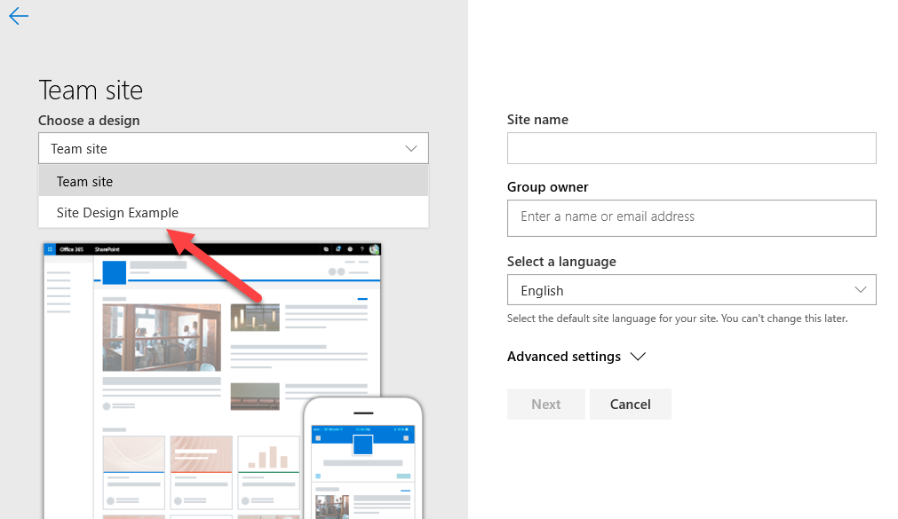

How to start Microsoft flow with PnP provision from a site design
===========================================================================================================================================

This article will show how to automatically start a Microsoft flow with PnP provision action from site design.
The feature could be helpfull when you need to deploy some elements which are not supported by the site design itself.
For example, if you need to set up some solution in multiple different tenants, in that case, deploying site designs and site scripts via a PnP provisioning template might be a good option.

As an example we'll create a SharePoint Modern page using PnP provision template, started from site design.
If you are new to Plumsail Actions, follow this `getting started instruction <../../../getting-started/sign-up.html>`_.
and also check out the `PnP provisioning scheme <https://github.com/SharePoint/PnP-Provisioning-Schema>`_.

Creating a PnP provisioning template
---------------------------------------------------------
Our plan is to start a Microsoft flow from site design and deploy a PnP provisioning template.
In the example, we will create a SharePoint Modern page using PnP provision template and to reach the goal we need to prepare the PnP template.

There are 2 ways for creating a PnP template: you can write it manually and specify all the entities,
or create the template in PowerShell. Please check out the following articles. We're using an example from the first one in the list.

- `How to create a SharePoint Modern page using PnP provision template in Microsoft Flow, Azure Logic Apps, or PowerApps <https://plumsail.com/docs/actions/v1.x/flow/how-tos/sharepoint/create-modern-page-pnp-template.html>`_ .
- `How to create a SharePoint list or library using PnP provisioning template in Microsoft Flow, Azure Logic Apps or PowerApps <https://plumsail.com/docs/actions/v1.x/flow/how-tos/sharepoint/create-list-library-pnp.html>`_ .
- `How to create a Modern SharePoint Team or Communication site using PnP provisioning template in Microsoft Flow, Azure Logic Apps or PowerApps <https://plumsail.com/docs/actions/v1.x/flow/how-tos/sharepoint/create-site-pnp.html>`_ .

Create the PnP file, we'll need it on the next steps.

Creating a flow
---------------------------------------------------------
We'll start our Flow when a specific site design is selected. Site design contains a site script which has a link to the created Microsoft Flow.
We can notify the Micrsoft flow that the site design is applied using trigger When an HTTP request is received.

Then add this JSON to the request body

.. code-block:: XML

  {
    "type": "object",
    "properties": {
        "webUrl": {
            "type": "string"
        },
        "parameters": {
            "type": "object",
            "properties": {
                "event": {
                    "type": "string"
                },
                "product": {
                    "type": "string"
                }
            }
        }
    }
    }

HTTP POST URL will be empty until you save the flow; We'll need the URL when creating our site script.

Then we get the created PnP template and place it to Plumsail action.

As you can see  we  select WebURL value in SharePoint site URL field. It is a dynamic value and provides the newly created site URL. 
We pass the parameter to Plumsail action so it will know where to apply the PnP template.

On the next steps we need to start the Flow automatically once the site is created. 

Creating a site design and site script
---------------------------------------------------------

Site design is a container which includes one or more site scripts. 
You can either make the site script manually or use an `online costructor <https://www.sitedesigner.io>`_.
Let's take this simple site script as an example:

.. code-block:: XML

  {
    "$schema": "schema.json",
    "actions": [
    {
            "verb": "triggerFlow",
            "url": "https://prod-103.westeurope.logic.azure.com:443/workflows/650287c069f94a1899e124147ec30a3a/triggers/manual/paths/invoke?api-version=2016-06-01&sp=%2Ftriggers%2Fmanual%2Frun&sv=1.0&sig=yyCX8RGjZNT61gvJ8euoGpCrNiRhELR8YULI2ptpBX0",
            "name": "Apply Template",
            "parameters": {
                "event":"",
                "product":""
            }
    }
    ],
    "bindata": {},
    "version": 1
  }

the URL parameter I took from When HTTP request is received trigger

After that we need to add the site script to our site design using some PowerShell commands:

- Select the JSON again and copy it.

- Open PowerShell and enter the following commands to copy the script into a variable and create the site script:

.. code-block::

    $script = Get-Clipboard -Raw
    Add-SPOSiteScript -Title "Apply PnP Provisioning Template" -Content $script
    Get-SPOSiteScript

- Select the ID of the site script that you created and copy it.
- Use the following command to create the site design:

.. code-block::

    Add-SPOSiteDesign -Title "Site Design example" -SiteScripts [Paste the ID of the Site Script here] -WebTemplate "64"

You can find the detailed instruction and some other related to the subject things in the oficial `Microsoft article <https://docs.microsoft.com/en-us/sharepoint/dev/declarative-customization/site-design-pnp-provisioning#create-the-site-design>`_.

Starting MS Flow from site design
---------------------------------------------------------

The last step is when you select the site design it triggers the created flow and deploy the PnP template with modern page.

That is all! Using Site designs and Plumsail action Provision PnP template to sharepoint together 
significantly expands the possibilities and automates creating unique site structures.

.. hint::
  You may also be interested in `this article <create-modern-page-pnp-template.html.html>`_ explaining how to create SharePoint lists or document libraries using PnP template.