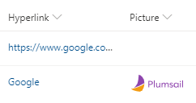
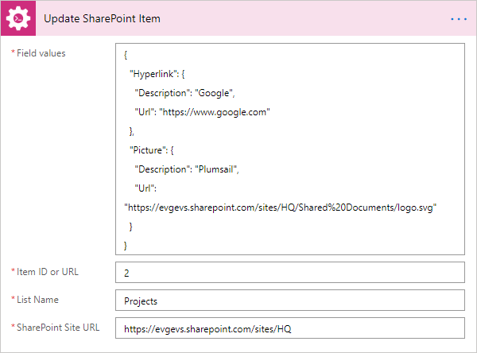

How to update a SharePoint list item with Microsoft Power Automate
==================================================================

Automation of updating SharePoint list items in Microsoft Power Automate (MS Flow) can be achieved with 3 ways:

* HTTP request to SharePoint (REST API)
* SharePoint Update Item action
* `Update SharePoint list item`_ action from `Plumsail Actions`_

The first way is very powerful and at the same time is quite complex since it requires knowledge of the REST API.
The second one is more user-friendly but it has own disadvantage: it’s not so flexible as you may need.
The Plumsail Action is a middle way that keeps the positive sides of the previous ones.

.. contents:: 
   :local:
   :depth: 1

Update only columns that you need, skip required columns
++++++++++++++++++++++++++++++++++++++++++++++++++++++++

Plumsail Actions can update only the columns you need ignoring others even if they are required.
Thus, you don’t have to waste time and add a needless action for getting the item properties and filling the required fields with the same data as they already have.
Besides, the site URL and list name can be set dynamically.

|Compare|

Update managed metadata column using term label or GUID
+++++++++++++++++++++++++++++++++++++++++++++++++++++++

Possible error:

.. code::

  {
    "status": 400,
    "message": "The data returned from the tagging UI was not formatted correctly..."
  }

You can use Plumsail Actions to update a managed metadata field with a custom value.
The value can be formatted in any of these ways:

* Label: Construction
* GUID: 17bc6c94-78b4-4d4c-af6c-25a210e7a305
* Label|GUID: Construction|17bc6c94-78b4-4d4c-af6c-25a210e7a305

|Term|

Update multi-value managed metadata column using term labels or GUIDS
+++++++++++++++++++++++++++++++++++++++++++++++++++++++++++++++++++++

The same is true for a managed metadata column with multiple values.
But instead of a string, you should pass to the field an array of strings:

|MultipleTerms|

Update hyperlink and picture columns with an alternative text
+++++++++++++++++++++++++++++++++++++++++++++++++++++++++++++

The standard action allows you updating a “Url” property of a column formatted as hyperlink only.
Updating a “Description” one (displayed text) or a picture column would require using an HTTP request.
The Plumsail action can receive an object and update both properties and both formats without complicating a flow:

|Link|

Here are the values without and with the “Description” property:

|DemoLink|

Update lookup columns
+++++++++++++++++++++

Updating of a lookup column requires only an integer value of a source item ID:

|Lookup|

Update multi-value lookup columns
+++++++++++++++++++++++++++++++++

To update a lookup column with multiple values, pass to an accordant JSON property an array of source item IDs:

|MultipleLookup|

.. _Update SharePoint list item: ../../actions/sharepoint-processing.html#update-sharepoint-list-item

.. _Plumsail Actions: https://plumsail.com/actions

