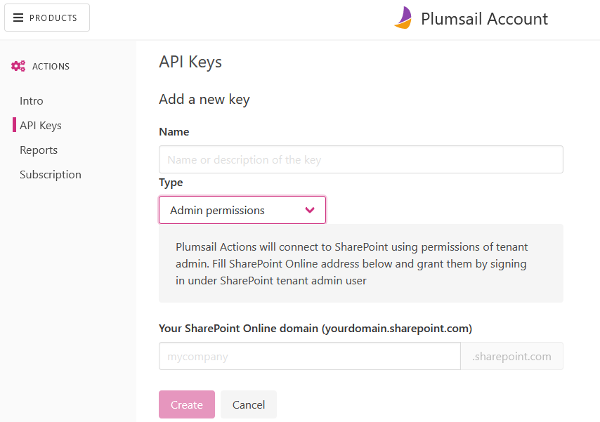
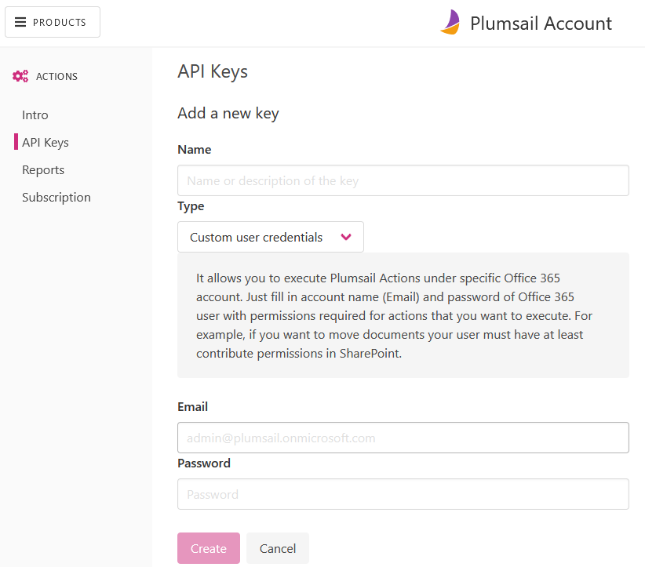
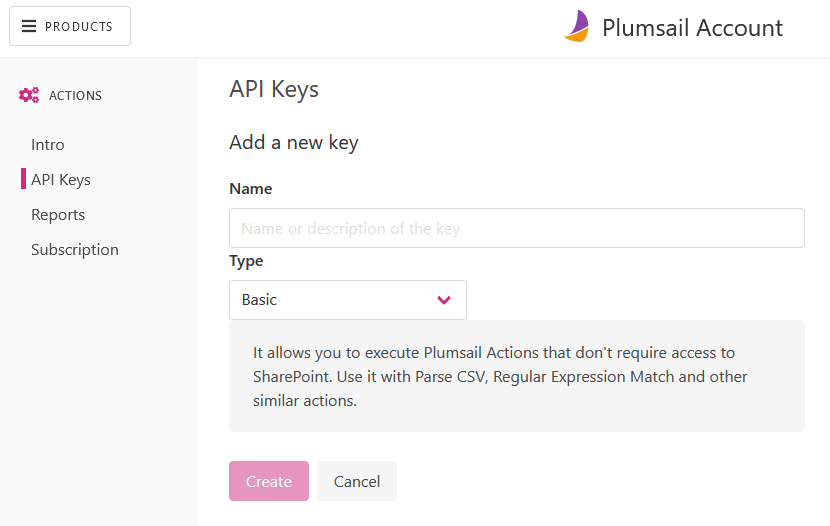
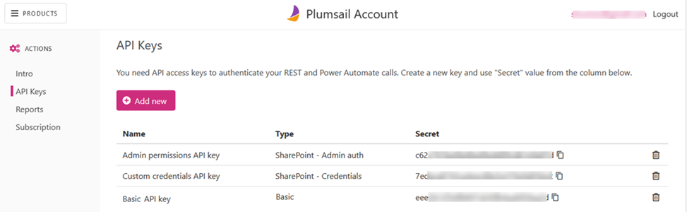

Register account and get API key
================================

Register account
----------------

First of all, you need to `register Plumsail Account <https://auth.plumsail.com/account/Register?ReturnUrl=https://account.plumsail.com/actions/intro/reg>`_. This account is used to manage Plumsail Actions and Plumsail Forms products.

It is better to use your active email address. The subscription will be linked to this address.

If you already have an account, just sign in to `account.plumsail.com <https://auth.plumsail.com/account/login?returnUrl=https://account.plumsail.com/actions/intro>`_.

Generate API key
----------------

You need to navigate to the "API Keys" section and click "Add new". Then select type of API key according to your needs.

.. image:: ../_static/img/getting-started/create-api-key.png
   :alt: API keys

SharePoint - Admin permissions
~~~~~~~~~~~~~~~~~~~~~~~~~~~~~~~

Plumsail Actions will connect to SharePoint using permissions of tenant admin. Fill SharePoint Online address below and grant them by signing in under SharePoint tenant admin user.

SharePoint - Custom credentials
~~~~~~~~~~~~~~~~~~~~~~~~~~~~~~~

This type of key allows SharePoint actions to work under account of specific user. You need to fill account name and password for your user:

.. note::
  To use this type of the API key, you need to create `App passwords`_ . Otherwise, it is necessary to disable `multi-factor authentication`_ (MFA) for a user under whose account the key is generated. Actions using the key will have the same level of permissions as the user.

SharePoint - Actions basic
~~~~~~~~~~~~~~~~~~~~~~~~~~~~~~~

It allows you to execute Plumsail Actions that don't require access to SharePoint. Use it with Parse CSV, Regular Expression Match and other similar actions.

Copy and use API key
--------------------

Once you created an API key, you can see your key right in the "Secret" column. You can also change a name of a key by clicking on it in the "Name" column:

|

Now you can copy and use it in:

- `Power Automate (Microsoft Flow) <use-from-flow.html>`_
- `REST API calls <use-as-rest-api.html>`_

.. _multi-factor authentication: https://docs.microsoft.com/en-gb/office365/admin/security-and-compliance/set-up-multi-factor-authentication?view=o365-worldwide
.. _Create Modern SharePoint Site: https://plumsail.com/docs/actions/v1.x/flow/actions/sharepoint-processing.html#create-modern-sharepoint-site
.. _App passwords: https://docs.microsoft.com/en-gb/azure/active-directory/user-help/multi-factor-authentication-end-user-app-passwords