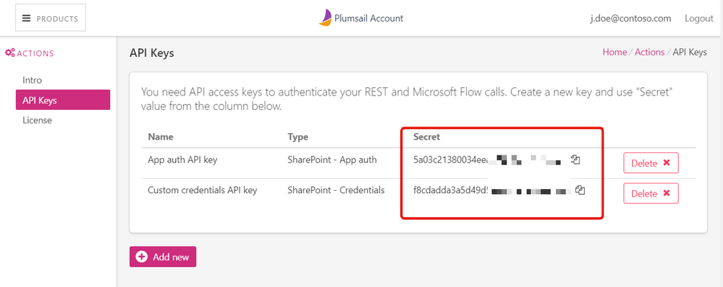

Register account and get API key
=======================================

Register account
----------------

First of all, you need to `register Plumsail Account <https://auth.plumsail.com/account/Register?ReturnUrl=https://account.plumsail.com/actions/intro/reg>`_. This account is used to manage Plumsail Actions and Plumsail Forms products.

It is better to use your active email address. The subscription will be linked to this address.

If you already have an account, just sign in to `account.plumsail.com <https://auth.plumsail.com/account/login?returnUrl=https://account.plumsail.com/actions/intro>`_.

Generate API key
----------------

You need to navigate to the "API Keys" section and click "Add new". Then select type of API key according to your needs.

.. image:: ../_static/img/getting-started/create-api-key.png
   :alt: API keys

SharePoint - App auth
~~~~~~~~~~~~~~~~~~~~~~

This type of key authenticates Actions as an app in your SharePoint tennant. You need to fill domain of your SharePoint Online, click "Submit" and then click "Accept" in the opened window. You may need to allow your browser to open popup windows.

.. image:: ../_static/img/getting-started/add-app-auth-api-key.png
   :alt: API keys

|

SharePoint - Custom credentials
~~~~~~~~~~~~~~~~~~~~~~~~~~~~~~~

This type of key allows SharePoint actions to work under account of specific user. You need to fill account name and password for your user:

.. image:: ../_static/img/getting-started/add-sp-credentials-api-key.png
   :alt: API keys

Copy and use API key
--------------------

Once you created an API key, you can see your key right in the "Secret" column. You can also change a name of a key by clicking on it in the "Name" column:

|

Now you can copy and use it in:

- `Microsoft Flow <use-from-flow.html>`_
- `REST API calls <use-as-rest-api.html>`_