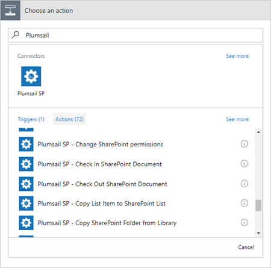
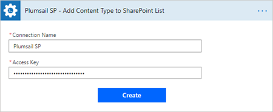

Use in Power Automate (Microsoft Flow)
======================================

Find `Plumsail SP <https://emea.flow.microsoft.com/en-us/connectors/shared_plumsailsp/plumsail-sp/>`_ in the list of available Power Automate (Microsoft Flow) connectors. Then you can search for "Plumsail" in you Flow and add appropriate action:

When you add an action for the first time you will be asked for *'Connection Name'* and for *'Access Key'*. You can type any name for the connection. For example, *'Plumsail SP'*. 

Then `create an API key in your Plumsail Account page <sign-up.html>`_ and paste it to *'Access Key'* input. 

Examples of Flows
-----------------

Once you clicked *'Create'* you can use Plumsail Actions in your Power Automate (Microsoft Flow)s. Review *'Power Automate (Microsoft Flow) examples'* to learn how to use them:

.. toctree::      
      :name: toc-microsoft-flow-examples
      :maxdepth: 2

      ../flow/how-tos/sharepoint/index-provision
      ../flow/how-tos/sharepoint/index-permissions
      ../flow/how-tos/sharepoint/index-documents
      ../flow/how-tos/sharepoint/index-listitems