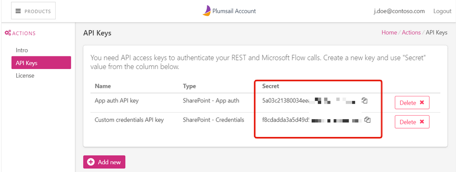

API Keys
=========================

API keys page contains all created API keys. 
API key is needed to authenticate your  `REST <https://plumsail.com/docs/documents/v1.x/getting-started/use-as-rest-api.html>`_ and  `Microsoft Flow calls <https://plumsail.com/docs/documents/v1.x/getting-started/use-from-flow.html>`_ .

You can create as many keys as you need, for example, for using with different MS Flow accounts. 
All the keys are tied to you plumsail account.

If you don't need a key anymore you can delete it, please make sure that the key is not used anymore.