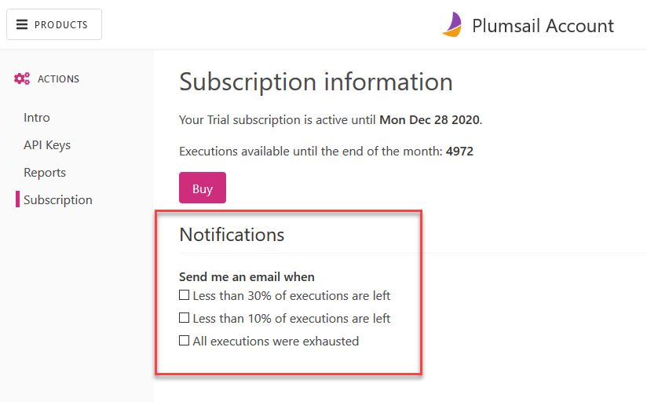

Subscription and notifications
==============================

Subscription page provides information about you current license and available executions.
You can manage email notifications about reaching limit of executions for Plumsail Actions in the `personal account <https://account.plumsail.com/actions/subscription>`_.

There are 3 options:

- Less than 30% of executions are left 
- Less than 10% of executions are left
- All documents were exhausted 

You'll receive the notifications to the account's email address, please make sure that the emails don't go to your spam folder.