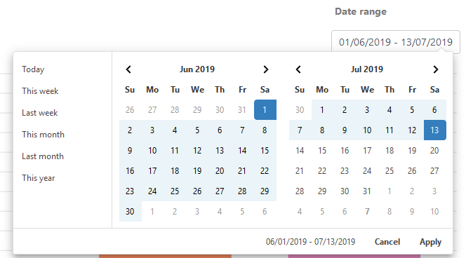
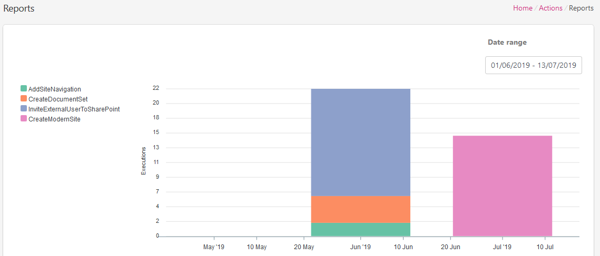
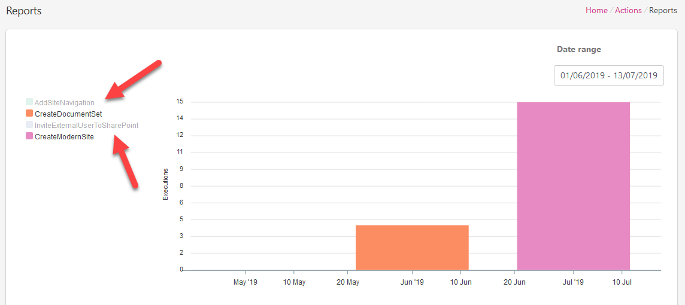

Reports
=======

You can find usage statistic on the `Reports page <https://account.plumsail.com/actions/reports>`_. It allows selecting specific interval or a single day.
For example, to find out what Documents actions were used from June 01, 2019 until July 13, 2019 you can select the range in the calendar

Reports show statistic for all Actions by default but you can disable some actions if it's needed.
To disable an action just select it in the actions list.

